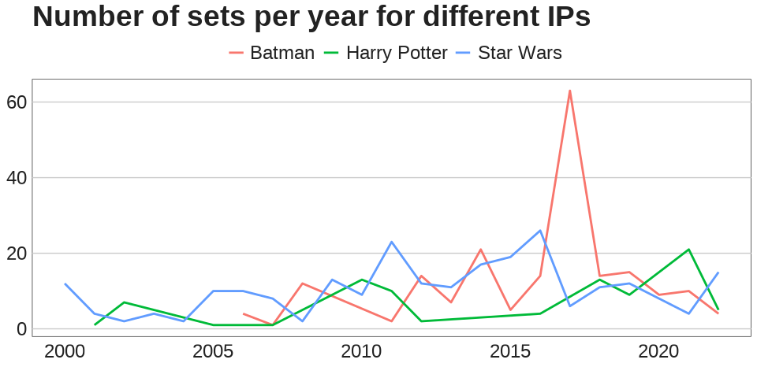

Tidy Tuesday - Week 36
================

``` r
library(dplyr)
library(ggplot2)
library(readr)
```

``` r
## Load Tidy Tuesday data
sets <- readr::read_csv('https://raw.githubusercontent.com/rfordatascience/tidytuesday/master/data/2022/2022-09-06/sets.csv.gz')
```

## “What happened with LEGOs? They used to be simple”

``` r
sets %>% 
  group_by(year) %>%
  filter(num_parts > 1) %>% 
  summarise(n = n()) %>% 
  ggplot(aes(year, n)) +
  geom_line(size = 0.8) +
  labs(y = "Number of sets (2 or more parts)",
       x = "year",
       title = "LEGO popularity over the years") +
  ren_style()
```


As we can see LEGO has gained immense popularity over the years. The
number of sets created each year has increased rapidly since the
beginning. But let’s explore the LEGO dataset further by answering the
question “What happened with LEGOs? They used to be simple”, a quote
from one of my favorite TV-series Community. See the full quote here:
“https://www.youtube.com/watch?v=yVCOAFKjaoY”

As a LEGO set, I defined any set consisting of 2 or more components. As
we can see, the complexity of LEGO sets - defined here as the average
number of components in a set - has steadily increased over the years.
However, this is not the full story: by looking at the average, minimum
and maximum number of components in sets over the years, we can see that
complexity itself has not necessarily increased, but the *most complex*
set contains more components over the years.

``` r
sets %>% 
  filter(num_parts > 1) %>% 
  group_by(year) %>% 
  summarise(mean = mean(num_parts)) %>% 
  ggplot(aes(year, mean)) +
  geom_line(size = 0.8, color = "#F8766D") +
  ren_style() +
  labs(title = "Average number of components in LEGO sets")
```


``` r
sets %>%
  filter(num_parts > 1) %>% 
  group_by(year) %>% 
  summarise(mean = mean(num_parts), max = max(num_parts), min = min(num_parts)) %>% 
  ggplot(aes(year)) +
  geom_line(aes(y = mean, color = "Average"), size = 0.8) +
  geom_line(aes(y = max, color = "Most"), size = 0.8) +
  geom_line(aes(y = min, color = "Least"), size = 0.8) +
  ren_style() +
  labs(title = "Number of components in LEGO sets")
```


This can be further clarified by looking at the distribution of the
number of components in LEGO sets for four years: 1949, 1968, 1986, 2004
and 2022. Here we can see that not only does the largest set become
larger, the number of disproportionately large LEGO sets increases over
the years as well.

``` r
sets %>% 
  filter(year %in% as.integer(summary(unique(sets$year)))) %>%
  filter(num_parts > 1) %>%
  mutate(year = as.factor(year)) %>% 
  group_by(year) %>% 
  ggplot(aes(x = year, y = num_parts, fill = year)) +
  geom_boxplot() +
  labs(y = "Number of components",
       x = "Year",
       title = "Distribution of number of set componenets") +
  ren_style() +
  theme(legend.position = "none")
```


``` r
ip_sets <- sets %>% 
  mutate(ip = case_when(
    stringr::str_detect(name, "Harry Potter") ==  TRUE ~ "Harry Potter",
    stringr::str_detect(name, "Star Wars") == TRUE ~ "Star Wars",
    stringr::str_detect(name, "Batman") == TRUE ~ "Batman"
  )
  )

ip_sets %>% 
  filter(!is.na(ip)) %>% 
  group_by(year, ip) %>% 
  summarise(n = n()) %>% 
  ggplot(aes(year, n, color = ip)) +
  geom_line(size = 1) +
  ren_style() +
  labs(title = "Number of sets per year for different IPs")
```



Finally we can look at the number of LEGO sets for existing IPs such as
Harry Potter and Star Wars. There is no clear growth in these kinds of
sets, as the popularity of these sets is probably strongly linked to the
release dates of the corresponding movies. I added Batman as a third IP,
but these sets are not as popular apart from one peak year.

## Conclusion

Did LEGO sets get more complex? Yes, but no. They used to be simple and
they still are. However the number and complexity of the *most complex*
sets has increased. Finally, in terms of LEGO sets connected to existing
IPs, there is not much to complain about except for 2017, the year of
LEGO Batman :-)
